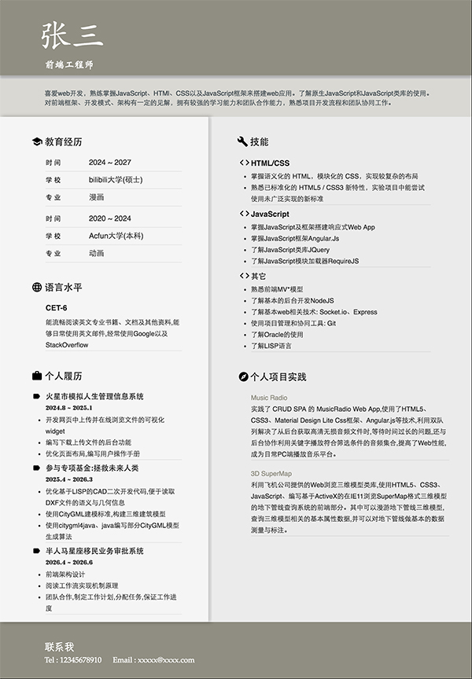

# angular-resume-generator

当前版本 0.16.08

angular-resume-generator 是一个基于 AngularJS 框架 Material Design 风格的简历生成器

## 特点 

+ Material Design 风格
+ AngularJS 轻应用框架
+ Node.js http-server 驱动

## 用法

### 安装 Node.js 与 npm , 运行

    npm install
    
### 在 config.json 填写个人数据

### 运行

    ./node_modules/http-server/bin/http-server
    
### 访问 

http://127.0.0.1:8000

## 下一步

+ 动态页面
+ 改进内容自适应

## 开源协议

本项目基于MIT协议开源，协议内容参见[LICENSE](LICENSE)。
